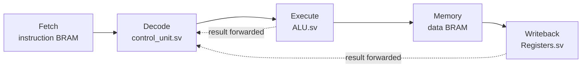
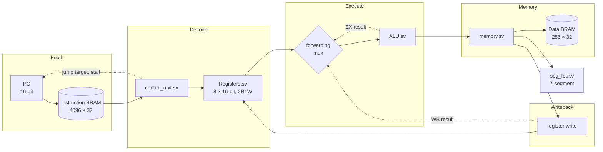

# RC16
This repository hosts the code for a custom CPU written with hardware description language Verilog, designed for education purposes. Inspired by computer architecture and hardware design courses in university, this project aims to design a minimal but functional version of the CPU architecture: Fetch, Decode, Execute, RAM LOAD/STORE and Register WRITEBACK. The instructions are stored in ROM. 

This is built and designed completely from scratch by `ChinHongTan` and `wifekurumi`, over a span of 3 weeks in our summer vacation, as an interesting side project after our year 1 university courses.

In its current form, it is a 5-stage pipelined 16-bit RISC processor with hardware data forwarding and hazard interlocks, implemented on a Xilinx Artix-7 FPGA board. The design used Harvard architecture and 2R1W register file. The Harvard architecture avoids the fetch-vs-memory hazard while 2R1W avoids the register-port hazard.

Two demo programs are provided: `program1.txt` to calculate fibonacci sequence, and `program2.txt` is a prime number calculator.

In testings, it can calculate prime numbers under 10000 in around 1.1 seconds at 25 MHz. Further improvements and optimisations in both hardware and software can still be made to further improve the performance though.

## Features
- **Pipelined CPU**: A 5-stage pipeline CPU providing roughly 2.5x speed improvement over non-pipelined version (code still available in the `review-point` branch).
- **Hazard handling**: Hardware level data forwarding and hazard interlocks
- **Assembler**: Assembler is available in `assembler.py`, it assembles custom assembly language to machine readable binary codes. It also comes with debugging and error features. It can catch register vs immediate type errors, wrong operand counts, and undefined labels with proper caret-pointing error messages.
- **Emulator**: Emulator in `emulator.py` that takes the binary codes, translates it and emulates it with an instruction-accurate reference model. It's used as a golden reference to verify the hardware behaviour against the testbench waveforms. It also comes with a static checker that catches errors like unreachable code, out of range jump targets and branches to the next instruction.
- **Memory Mapped I/O**: Addresses at and above 65500 are reserved for I/O devices, so the CPU can handle a lot more I/O devices and doesn't need new opcodes.

## Architecture

| | |
|---|---|
| Data width | 16-bit registers and ALU |
| Instruction width | 32-bit fixed (30 used, 2 reserved) |
| Registers | 8 × 16-bit, 2R1W (`R0`–`R7`) |
| Program counter | 16-bit |
| Instruction memory | 4096 words, Harvard, read-only |
| Data memory | 256 × 32-bit |
| Instructions | 28 |
| Clock | 25 MHz on Artix-7 XC7A35T-1 |

Instructions move through five stages, one stage per clock:



The full datapath, including where operands come from and how the display is
driven:



### Hazard handling

TODO

## Repo Structure

**Source files**

| File | Role |
|---|---|
| [top.sv](top.sv) | Top module: PC, pipeline registers, forwarding mux, execute stage |
| [top.svh](top.svh) | Shared types, memory widths, opcode enum |
| [control_unit.sv](control_unit.sv) | Decode stage, control signals, hazard control |
| [ALU.sv](ALU.sv) / [ALU_Pkg.sv](ALU_Pkg.sv) | ALU and its mode enum |
| [Registers.sv](Registers.sv) | 2R1W register file |
| [BRAM.sv](BRAM.sv) | Parameterised block RAM, instantiated for both memories |
| [memory.sv](memory.sv) | Memory stage and data-BRAM wrapper |
| [seg_four.v](seg_four.v) | 4-digit 7-segment display driver |
| [to1Hz.sv](to1Hz.sv) | Clock divider for on-board stepping |
| [XDC_USE.xdc](XDC_USE.xdc) | Pin constraints for the Artix-7 board |

**Toolchain**

| File | Role |
|---|---|
| [assembler.py](assembler.py) | Assembles the custom assembly language to `ex1.mem` |
| [emulator.py](emulator.py) | Instruction-accurate reference model and static checker |
| [pipeline.py](pipeline.py) | Pipeline visualiser built on the emulator |
| [strip_top.py](strip_top.py) | Removes Verilator's wrapper scope from the VCD |

**Verification and programs**

| File | Role |
|---|---|
| [CPU_tb.sv](CPU_tb.sv) / [BRAM_tb.sv](BRAM_tb.sv) | Testbenches |
| [command_for_TB](command_for_TB) | Simulation command lines |
| [program1.txt](program1.txt) / [program2.txt](program2.txt) | Fibonacci and prime demos |
| [ISA.md](ISA.md) | Full instruction set reference |

## Setup
### Requirements
This project is built with the following software / hardware:
- Xilinx Artix-7 FPGA board (XC7A35T-1)
- Vivado 2019.2
- Python 3.12.3

### Setup
Clone this repo:

```
git clone https://github.com/ChinHongTan/verilog_cpu.git
```

Then, open Vivado and create a new project. Make sure you are creating a new project for FPGA board that has the code XC7A35T-1. Then, proceed to add design sources, and select the cloned repository folder. Add constrain sources too and select XDC_USE.xdc. 

Run `assembler.py` to assemble the binary file. You can change the target filepath in line 13:

```py
DEFAULTFILENAME = "program2.txt"
```

Go to Vivado, generate bitstream (might take some time), and program device after it is finished. SW0 (rightmost switch) is used to reset the board, and SW15 (leftmost switch) is used to pause the board in its current state.

## Roadmaps
Here are some goals that we planned, but might not get implemented due to time constraints:
- **Branch prediction**: Currently we assume that every jumps will fall through, so a taken branch costs a few wasted cycles.
- **Support for more I/O devices**: We only have support for the 7-segment display that's on board of the FPGA. Support for monitor output via VGA and keyboard input via PS2 are planned. USB-UART bridge support also considered for video player.
- **Better assembler support**: The assembler now only reads custom assembly language, and does not include optimisation for code to minimise hazards. We might add in custom C-like syntax language and a compiler in the future.

## References

- [Initialize Memory in Verilog](https://projectf.io/posts/initialize-memory-in-verilog/) — Project F, on `$readmemh`/`$readmemb` and BRAM initialisation.
- [Understanding FPGA BRAM](https://medium.com/@u22ec101/understanding-fpga-bram-simulating-initializing-and-dumping-memory-in-verilog-71105f2d10dd) — simulating, initialising and dumping memory in Verilog.